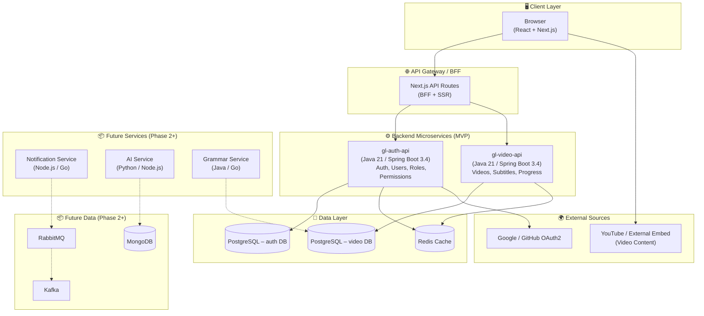
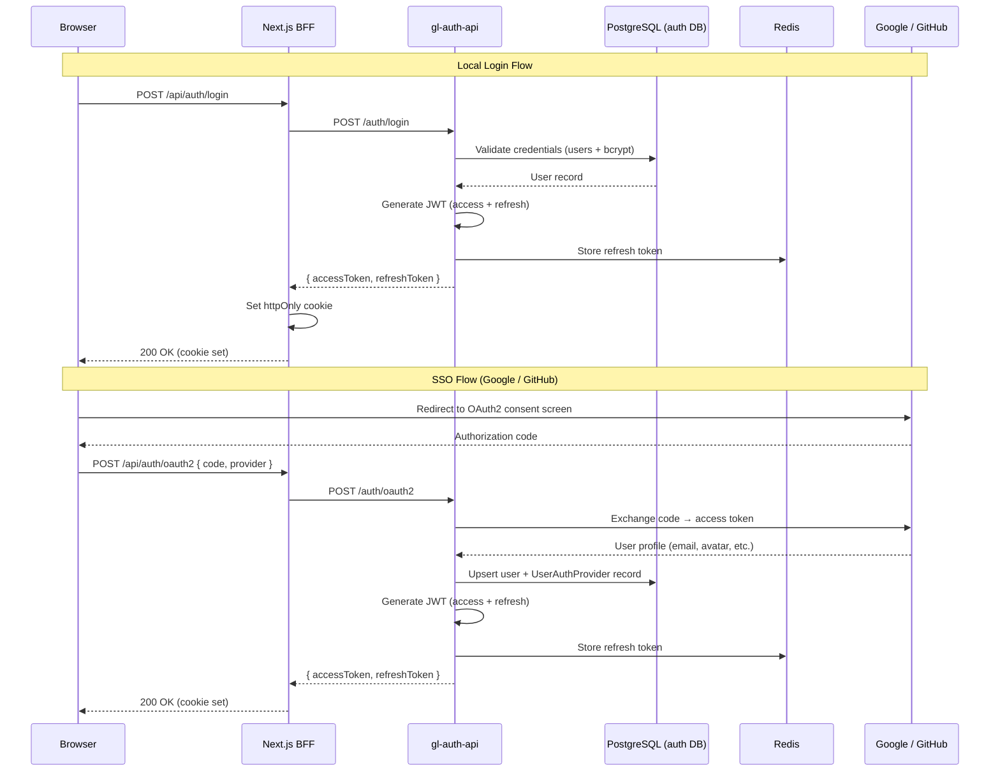
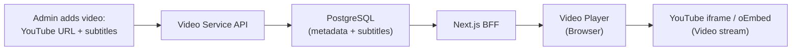
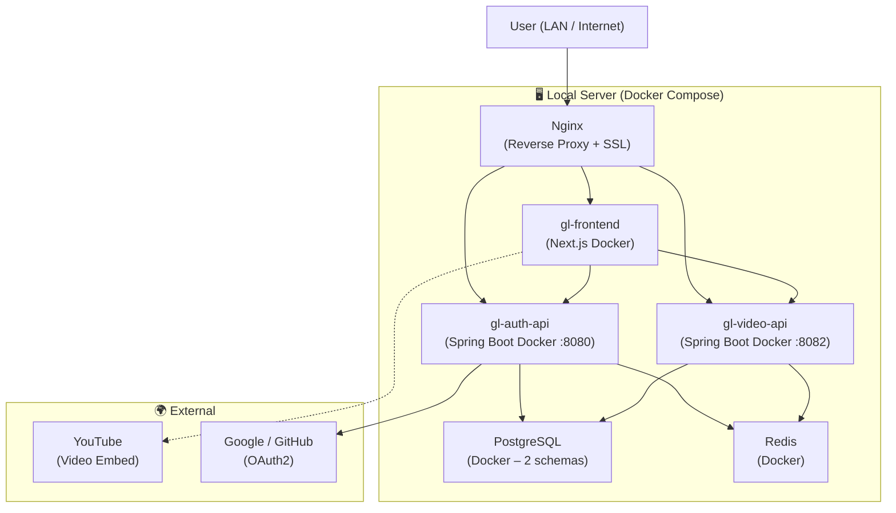

# GLStudy – System Architecture

## 1. High-Level Architecture



## 2. Architecture Decisions

### 2.1 Microservices from Day One

| Service | Repository | Responsibility | Port |
|---|---|---|---|
| **gl-auth-api** | `glstudy/gl-auth-api` | Auth (local + SSO), User management, Roles & Permissions | 8080 |
| **gl-video-api** | `glstudy/gl-video-api` | Video catalog, Subtitles, Watch progress, Stats | 8082 |

> **Decision**: MVP starts with **2 independent Spring Boot microservices**, each with its own PostgreSQL schema. This aligns with the existing `gl-auth-api` project already in progress. Services communicate only via REST (no shared DB). The BFF (Next.js API Routes) aggregates responses.

### 2.2 Why Next.js as BFF (Backend-for-Frontend)

- **SSR/SSG** for SEO-friendly pages (landing, video catalog)
- **API Routes** act as a thin proxy/aggregation layer between the React frontend and Java backend
- **Image optimization** built-in for thumbnails
- Avoids CORS complexity in production

### 2.3 Authentication Strategy (Local + SSO)



**SSO providers supported in Phase 1**: Google, GitHub (already implemented in `gl-auth-api`)
- JWT-based with short-lived access tokens (15 min) and long-lived refresh tokens (7 days)
- Refresh tokens stored in Redis for fast validation & revocation
- Access tokens stored in **httpOnly secure cookies** (not localStorage) to prevent XSS
- `UserAuthProvider` table tracks which provider(s) a user has linked
- **Only `gl-auth-api` handles authentication** — other services (e.g. `gl-video`) do NOT include Spring Security
- The BFF authenticates requests via `gl-auth-api` and passes `userId` to downstream services via headers

### 2.4 Video Delivery Strategy (YouTube Embed)



- **No file hosting needed in MVP** — videos are embedded from YouTube or other external sources
- Admin enters a YouTube URL (or any embeddable URL) when creating a video entry
- The backend extracts the **YouTube video ID** from the URL for embedding
- **Subtitles** are still stored as structured rows in PostgreSQL (not YouTube's auto-captions), enabling bilingual toggle and future AI features
- The player renders as a YouTube `<iframe>` embed with our custom subtitle overlay on top
- In Phase 2+, self-hosted videos can be added without breaking the existing data model

## 3. Technology Stack – MVP

| Layer | Technology | Rationale |
|---|---|---|
| **Frontend** | React 18 + Next.js 14 (App Router) | SSR, routing, API routes, image optimization |
| **UI Library** | Tailwind CSS + Radix UI | Rapid, accessible UI development |
| **State Mgmt** | Zustand + React Query | Client state + server state caching |
| **Video Embed** | YouTube IFrame API / oEmbed | No hosting cost, zero storage in MVP |
| **Backend** | **Java 21** / **Spring Boot 3.4.x** | LTS Java, virtual threads, modern ecosystem |
| **ORM** | Spring Data JPA + Hibernate | Standard, migrations via Flyway |
| **Auth** | Spring Security + JWT (jjwt 0.12.x) | Industry standard |
| **SSO** | Google OAuth2 + GitHub OAuth2 | Already implemented in `gl-auth-api` |
| **Mapping** | MapStruct 1.6+ | Type-safe DTO mapping (already in project) |
| **Database** | PostgreSQL 15+ | ACID, JSON support, full-text search |
| **Cache** | Redis 7+ | Session/token cache, rate limiting |
| **API Docs** | Springdoc OpenAPI 2.x | Auto-generated Swagger UI |
| **Testing** | JUnit 5 + Mockito (BE), Jest + RTL (FE) | Standard testing stack |

### Future Additions (Phase 2+)

| Technology | Purpose | Phase |
|---|---|---|
| MongoDB | AI-generated content, flexible schemas | Phase 3 |
| RabbitMQ | Async task processing (notifications) | Phase 2 |
| Kafka | Event streaming (analytics, audit logs) | Phase 3 |
| Node.js / Go | Notification & integration services | Phase 2 |
| Kubernetes | Container orchestration | Phase 3 |
| GitHub Actions | CI/CD pipeline | Phase 2 |

## 4. Backend Service Structure

Each backend service (e.g. `gl-auth-api`, `gl-video-api`) follows the same internal layout:

```
src/
├── main/
│   ├── java/{base_package}/<service-name>/
│   │   ├── <ServiceNameApplication>.java
│   │   ├── config/                  # Security, Redis, CORS, RestTemplate, etc.
│   │   │   ├── security/            # SecurityConfiguration, JWT filter, OAuth2 providers
│   │   │   ├── cache/               # RedisConfig
│   │   │   ├── datasource/          # DataSourceConfig (Postgres)
│   │   │   ├── resttemplate/        # RestClient, RestTemplateConfiguration
│   │   │   └── validation/          # Custom validators (@In, etc.)
│   │   ├── controller/              # REST controllers (one per resource)
│   │   ├── service/                 # Business logic interfaces + implementations
│   │   ├── repository/              # Spring Data JPA repositories
│   │   ├── model/
│   │   │   ├── entity/              # JPA entities (@Entity, @Table)
│   │   │   ├── dto/                 # Request / Response DTOs
│   │   │   │   ├── request/         # Inbound payloads
│   │   │   │   └── response/        # Outbound payloads
│   │   │   └── mapper/              # MapStruct mappers (Entity <-> DTO)
│   │   ├── constant/                # Enums, string constants
│   │   └── exception/               # GlobalExceptionHandler, ApiException, ErrorResponse
│   └── resources/
│       ├── application.yml          # Main config
│       ├── application-local.yml    # Local dev overrides (gitignored)
│       └── db/
│           └── migration/           # Flyway SQL migrations (V1__, V2__, ...)
└── test/
    └── java/{base_package}/<service-name>/
        ├── controller/              # Controller layer unit tests (MockMvc)
        ├── service/                 # Service layer unit tests (Mockito)
        └── integration/             # Integration tests (Spring Boot test slice)
```

> This structure mirrors the existing `gl-auth-api` codebase. All new services should follow the same conventions for consistency.

## 5. Deployment Architecture (MVP – Local Server)



**All services run on a single local server via Docker Compose.** Nginx routes by path prefix (`/auth/*` → gl-auth-api, `/api/videos/*` → gl-video-api, `/` → frontend). Two PostgreSQL schemas (`auth` + `video`) can live in the same PostgreSQL instance to keep infra simple while respecting service boundaries.

## 6. Security Considerations

| Area | MVP Implementation |
|---|---|
| **Authentication** | JWT with httpOnly cookies, bcrypt password hashing |
| **Authorization** | Simple role check (user/admin) in Spring Security |
| **Input validation** | Bean Validation (Jakarta) on all DTOs |
| **SQL injection** | Parameterized queries via JPA |
| **XSS** | React auto-escaping + CSP headers |
| **CSRF** | SameSite cookies + CSRF token for mutations |
| **Rate limiting** | Redis-based rate limiter on auth endpoints |
| **HTTPS** | Enforced in production via Nginx/LB |
| **YouTube embed** | Allowlist YouTube domains in CSP; validate YouTube URL format on input |

---

*Next: [03-database-schema.md](./03-database-schema.md)*
