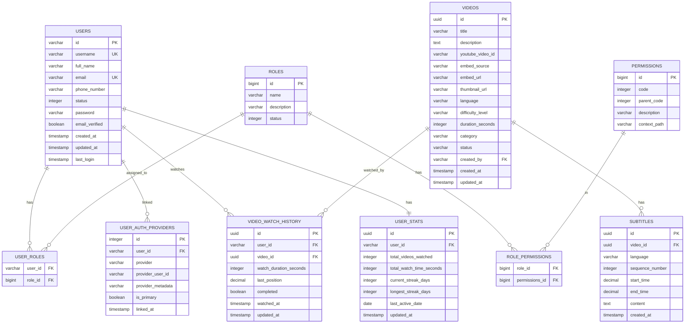
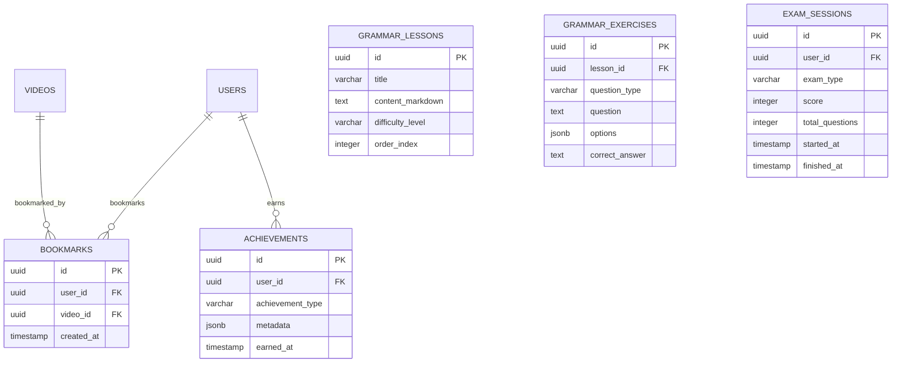

# GLStudy – Database Schema Design

## 1. Entity Relationship Diagram (MVP)



> **Schema ownership**: The `users`, `roles`, `permissions`, `user_roles`, `role_permissions`, and `user_auth_providers` tables belong to **`gl-auth-api`** (auth schema). The `videos`, `subtitles`, `video_watch_history`, and `user_stats` tables belong to **`gl-video-api`** (video schema). Both schemas can run in the same PostgreSQL instance under different schema names.

## 2. Table Definitions

### Auth Schema (`gl-auth-api`)

> These tables already exist in the `gl-auth-api` project. Definitions below document the actual entities as implemented.

### 2.1 `users`

| Column | Type | Constraints | Description |
|---|---|---|---|
| `id` | `VARCHAR` | PK | Nanoid-generated string ID |
| `username` | `VARCHAR` | UNIQUE, NOT NULL | Username |
| `full_name` | `VARCHAR` | NULLABLE | Display name |
| `email` | `VARCHAR(255)` | UNIQUE, NOT NULL | Login email |
| `phone_number` | `VARCHAR` | NULLABLE | Phone number |
| `status` | `INTEGER` | NULLABLE | User status (0=inactive, 1=active) |
| `password` | `VARCHAR` | NULLABLE | Bcrypt-hashed password (null for SSO-only users) |
| `email_verified` | `BOOLEAN` | NULLABLE | Whether email is verified |
| `created_at` | `TIMESTAMP` | NOT NULL | Registration time |
| `updated_at` | `TIMESTAMP` | NOT NULL | Last update |
| `last_login` | `TIMESTAMP` | NULLABLE | Last login timestamp |

> **Note**: `id` uses **nanoid** (library: `com.aventrix.jnanoid`) rather than UUID — shorter, URL-safe, and already wired into the existing codebase.

---

### 2.2 `roles`

| Column | Type | Constraints | Description |
|---|---|---|---|
| `id` | `BIGINT` | PK, sequence | Auto-generated ID |
| `name` | `VARCHAR` | NULLABLE | Role name (e.g. `ROLE_LEARNER`, `ROLE_ADMIN`) |
| `description` | `VARCHAR` | NULLABLE | Human-readable description |
| `status` | `INTEGER` | NULLABLE | Active/inactive flag |

---

### 2.3 `permissions`

| Column | Type | Constraints | Description |
|---|---|---|---|
| `id` | `BIGINT` | PK, sequence | Auto-generated ID |
| `code` | `INTEGER` | NULLABLE | Permission code |
| `parent_code` | `INTEGER` | NULLABLE | Parent permission code |
| `description` | `VARCHAR` | NULLABLE | Description |
| `context_path` | `VARCHAR` | NULLABLE | API path this permission covers |

---

### 2.4 Junction Tables

| Table | Columns | Description |
|---|---|---|
| `user_roles` | `user_id` FK, `role_id` FK | Users ↔ Roles many-to-many |
| `role_permissions` | `role_id` FK, `permissions_id` FK | Roles ↔ Permissions many-to-many |

---

### 2.5 `user_auth_providers`

| Column | Type | Constraints | Description |
|---|---|---|---|
| `id` | `INTEGER` | PK, sequence | Auto-generated ID |
| `user_id` | `VARCHAR` | FK → users.id, NOT NULL | Owning user |
| `provider` | `VARCHAR` | NULLABLE | `local`, `google`, `github` |
| `provider_user_id` | `VARCHAR` | NULLABLE | Provider's user ID (sub) |
| `provider_metadata` | `VARCHAR` | NULLABLE | JSON metadata from provider |
| `is_primary` | `BOOLEAN` | NULLABLE | Whether this is the primary login method |
| `linked_at` | `TIMESTAMP` | NOT NULL | When the provider was linked |

**Indexes:**
- `idx_user_auth_providers_user_id` on `user_id`
- `UNIQUE (user_id, provider)` — one entry per user per provider

---

### Video Schema (`gl-video-api`)

| Column | Type | Constraints | Description |
|---|---|---|---|
| `id` | `UUID` | PK | Primary key |
| `title` | `VARCHAR(255)` | NOT NULL | Video title |
| `description` | `TEXT` | NULLABLE | Video description |
| `youtube_video_id` | `VARCHAR(50)` | NULLABLE | Extracted YouTube video ID (e.g. `dQw4w9WgXcQ`) |
| `embed_source` | `VARCHAR(20)` | NOT NULL, DEFAULT 'YOUTUBE' | `YOUTUBE`, `VIMEO`, `OTHER` |
| `embed_url` | `VARCHAR(500)` | NOT NULL | Full embed URL (e.g. `https://youtube.com/watch?v=...`) |
| `thumbnail_url` | `VARCHAR(500)` | NULLABLE | Custom thumbnail; falls back to YouTube OG image |
| `language` | `VARCHAR(10)` | NOT NULL, DEFAULT 'en' | Primary language |
| `difficulty_level` | `VARCHAR(20)` | NOT NULL | `BEGINNER`, `INTERMEDIATE`, `ADVANCED` |
| `duration_seconds` | `INTEGER` | NOT NULL | Video duration |
| `category` | `VARCHAR(100)` | NULLABLE | Content category |
| `status` | `VARCHAR(20)` | NOT NULL, DEFAULT 'DRAFT' | `DRAFT`, `PUBLISHED`, `ARCHIVED` |
| `created_by` | `UUID` | FK → users.id | Admin who created the entry |
| `created_at` | `TIMESTAMPTZ` | NOT NULL, DEFAULT NOW() | Creation time |
| `updated_at` | `TIMESTAMPTZ` | NOT NULL, DEFAULT NOW() | Last update |

> **Design note**: `youtube_video_id` is extracted server-side from `embed_url` on creation. This allows the frontend to build embed URLs like `https://www.youtube.com/embed/{youtube_video_id}` without re-parsing.

**Indexes:**
- `idx_videos_status` on `status`
- `idx_videos_difficulty` on `difficulty_level`
- `idx_videos_category` on `category`
- `idx_videos_created_at` on `created_at DESC`

---

### 2.4 `subtitles`

| Column | Type | Constraints | Description |
|---|---|---|---|
| `id` | `UUID` | PK | Primary key |
| `video_id` | `UUID` | FK → videos.id, NOT NULL | Parent video |
| `language` | `VARCHAR(10)` | NOT NULL | `en` or `vi` |
| `sequence_number` | `INTEGER` | NOT NULL | Order within the video |
| `start_time` | `DECIMAL(10,3)` | NOT NULL | Start time in seconds |
| `end_time` | `DECIMAL(10,3)` | NOT NULL | End time in seconds |
| `content` | `TEXT` | NOT NULL | Subtitle text |
| `created_at` | `TIMESTAMPTZ` | NOT NULL, DEFAULT NOW() | Creation time |

**Indexes:**
- `idx_subtitles_video_lang` on `(video_id, language)` 
- `idx_subtitles_video_seq` on `(video_id, language, sequence_number)` (unique)
- `idx_subtitles_time_range` on `(video_id, language, start_time, end_time)`

**Constraints:**
- `UNIQUE (video_id, language, sequence_number)`
- `CHECK (end_time > start_time)`

---

### 2.5 `video_watch_history`

| Column | Type | Constraints | Description |
|---|---|---|---|
| `id` | `UUID` | PK | Primary key |
| `user_id` | `UUID` | FK → users.id, NOT NULL | Watcher |
| `video_id` | `UUID` | FK → videos.id, NOT NULL | Watched video |
| `watch_duration_seconds` | `INTEGER` | NOT NULL, DEFAULT 0 | How long they watched |
| `last_position` | `DECIMAL(10,3)` | NOT NULL, DEFAULT 0 | Resume position (seconds) |
| `completed` | `BOOLEAN` | NOT NULL, DEFAULT FALSE | Watched ≥ 90% |
| `watched_at` | `TIMESTAMPTZ` | NOT NULL, DEFAULT NOW() | First watch time |
| `updated_at` | `TIMESTAMPTZ` | NOT NULL, DEFAULT NOW() | Last progress update |

**Indexes:**
- `idx_watch_user_video` on `(user_id, video_id)` (unique – one record per user-video pair)
- `idx_watch_user_completed` on `(user_id, completed)`
- `idx_watch_watched_at` on `watched_at DESC`

**Constraints:**
- `UNIQUE (user_id, video_id)` – upsert on re-watch

---

### 2.6 `user_stats` (Denormalized for Performance)

| Column | Type | Constraints | Description |
|---|---|---|---|
| `id` | `UUID` | PK | Primary key |
| `user_id` | `UUID` | FK → users.id, UNIQUE, NOT NULL | Stats owner |
| `total_videos_watched` | `INTEGER` | NOT NULL, DEFAULT 0 | Completed videos |
| `total_watch_time_seconds` | `INTEGER` | NOT NULL, DEFAULT 0 | Total time spent |
| `current_streak_days` | `INTEGER` | NOT NULL, DEFAULT 0 | Current learning streak |
| `longest_streak_days` | `INTEGER` | NOT NULL, DEFAULT 0 | All-time best streak |
| `last_active_date` | `DATE` | NULLABLE | Last day user watched a video |
| `updated_at` | `TIMESTAMPTZ` | NOT NULL, DEFAULT NOW() | Last update |

**Indexes:**
- `idx_user_stats_user_id` on `user_id` (unique)

> **Design note**: This table is denormalized to avoid expensive `COUNT(*)` queries on the watch history table. Updated via application logic whenever a video is marked as completed.

---

## 3. Flyway Migration Strategy

```
db/migration/
├── V1__create_users_table.sql
├── V2__create_refresh_tokens_table.sql
├── V3__create_videos_table.sql
├── V4__create_subtitles_table.sql
├── V5__create_video_watch_history_table.sql
├── V6__create_user_stats_table.sql
├── V7__seed_admin_user.sql
└── V8__seed_sample_data.sql          (dev only)
```

## 4. Future Schema Extensions (Phase 2+)



---

*Next: [04-api-specification.md](./04-api-specification.md)*
