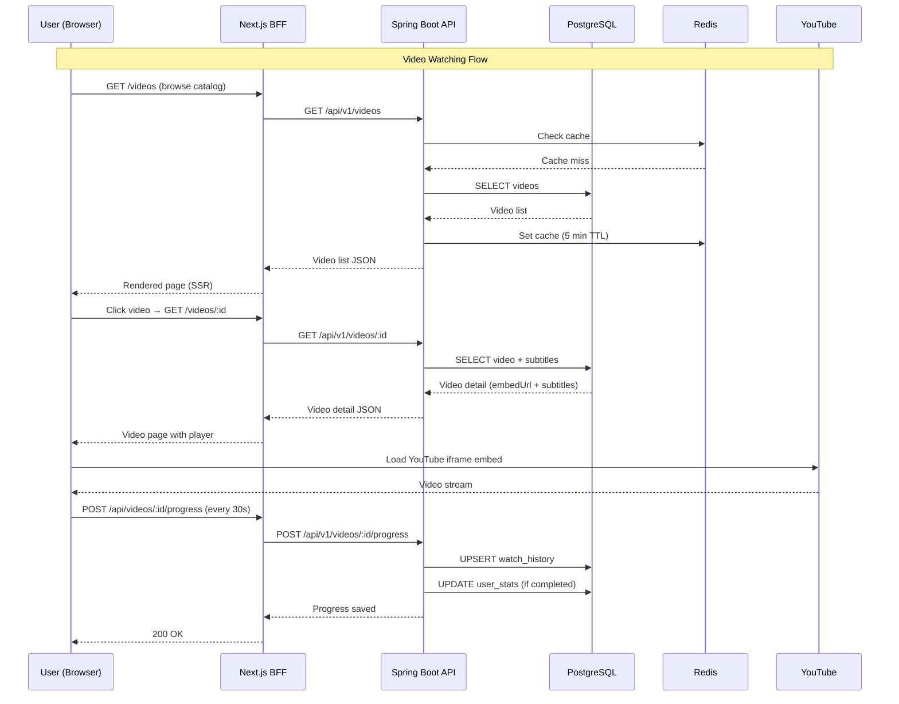

# GLStudy – API Specification (MVP)

## 1. API Overview

| Property | Value |
|---|---|
| **Base URL (Backend)** | `http://localhost:8080/api/v1` |
| **Base URL (BFF)** | `http://localhost:3000/api` |
| **Auth** | JWT Bearer Token (via httpOnly cookie) |
| **Content-Type** | `application/json` |
| **API Docs** | Swagger UI at `/swagger-ui.html` |

### Standard Response Envelope

```json
{
  "success": true,
  "data": { ... },
  "error": null,
  "timestamp": "2026-02-26T10:00:00Z"
}
```

### Standard Error Response

```json
{
  "success": false,
  "data": null,
  "error": {
    "code": "AUTH_001",
    "message": "Invalid credentials",
    "details": null
  },
  "timestamp": "2026-02-26T10:00:00Z"
}
```

### Error Codes

| Code | HTTP Status | Description |
|---|---|---|
| `AUTH_001` | 401 | Invalid credentials |
| `AUTH_002` | 401 | Token expired |
| `AUTH_003` | 403 | Access denied |
| `AUTH_004` | 409 | Email already registered |
| `VAL_001` | 400 | Validation error |
| `RES_001` | 404 | Resource not found |
| `SRV_001` | 500 | Internal server error |

---

## 2. Authentication APIs

### 2.1 Register

```
POST /api/v1/auth/register
```

**Request:**
```json
{
  "email": "user@example.com",
  "password": "SecureP@ss1",
  "displayName": "Nguyễn Văn A"
}
```

**Validation:**
- `email`: valid format, max 255 chars
- `password`: min 8 chars, 1 uppercase, 1 number, 1 special char
- `displayName`: 2–100 chars

**Response (201):**
```json
{
  "success": true,
  "data": {
    "id": "550e8400-e29b-41d4-a716-446655440000",
    "email": "user@example.com",
    "displayName": "Nguyễn Văn A",
    "role": "LEARNER",
    "createdAt": "2026-02-26T10:00:00Z"
  }
}
```

---

### 2.2 Login

```
POST /api/v1/auth/login
```

**Request:**
```json
{
  "email": "user@example.com",
  "password": "SecureP@ss1"
}
```

**Response (200):**
```json
{
  "success": true,
  "data": {
    "accessToken": "eyJhbGciOi...",
    "refreshToken": "dGhpcyBpcyBh...",
    "expiresIn": 900,
    "user": {
      "id": "550e8400-...",
      "email": "user@example.com",
      "displayName": "Nguyễn Văn A",
      "role": "LEARNER"
    }
  }
}
```

> **Note**: In production, tokens are set as httpOnly cookies by the BFF layer, not returned in the response body.

---

### 2.3 Refresh Token

```
POST /api/v1/auth/refresh
```

**Request:**
```json
{
  "refreshToken": "dGhpcyBpcyBh..."
}
```

**Response (200):**
```json
{
  "success": true,
  "data": {
    "accessToken": "eyJhbGciOi...(new)",
    "expiresIn": 900
  }
}
```

---

### 2.4 Logout

```
POST /api/v1/auth/logout
```

**Headers:** `Authorization: Bearer <accessToken>`

**Response (200):**
```json
{
  "success": true,
  "data": {
    "message": "Logged out successfully"
  }
}
```

---

## 3. User APIs

### 3.1 Get Current User Profile

```
GET /api/v1/users/me
```

**Headers:** `Authorization: Bearer <accessToken>`

**Response (200):**
```json
{
  "success": true,
  "data": {
    "id": "550e8400-...",
    "email": "user@example.com",
    "displayName": "Nguyễn Văn A",
    "avatarUrl": "https://cdn.example.com/avatars/user.jpg",
    "role": "LEARNER",
    "stats": {
      "totalVideosWatched": 12,
      "totalWatchTimeSeconds": 3600,
      "currentStreakDays": 5,
      "longestStreakDays": 14
    },
    "createdAt": "2026-02-26T10:00:00Z"
  }
}
```

---

### 3.2 Update User Profile

```
PUT /api/v1/users/me
```

**Headers:** `Authorization: Bearer <accessToken>`

**Request:**
```json
{
  "displayName": "Nguyễn Văn B",
  "avatarUrl": "https://cdn.example.com/avatars/new.jpg"
}
```

**Response (200):** *(same as 3.1)*

---

### 3.3 Change Password

```
PUT /api/v1/users/me/password
```

**Request:**
```json
{
  "currentPassword": "OldP@ss1",
  "newPassword": "NewP@ss2"
}
```

**Response (200):**
```json
{
  "success": true,
  "data": { "message": "Password changed successfully" }
}
```

---

## 4. Video APIs

### 4.1 List Videos (Paginated)

```
GET /api/v1/videos?page=0&size=12&difficulty=BEGINNER&category=conversation&sort=createdAt,desc
```

**Query Parameters:**

| Param | Type | Default | Description |
|---|---|---|---|
| `page` | int | 0 | Page number (0-indexed) |
| `size` | int | 12 | Items per page (max 50) |
| `difficulty` | string | — | Filter: `BEGINNER`, `INTERMEDIATE`, `ADVANCED` |
| `category` | string | — | Filter by category |
| `search` | string | — | Full-text search in title/description |
| `sort` | string | `createdAt,desc` | Sort field and direction |

**Response (200):**
```json
{
  "success": true,
  "data": {
    "content": [
      {
        "id": "video-uuid-1",
        "title": "Daily Conversations at a Café",
        "description": "Learn ordering coffee...",
        "thumbnailUrl": "https://cdn.example.com/thumbs/v1.jpg",
        "difficultyLevel": "BEGINNER",
        "category": "conversation",
        "durationSeconds": 180,
        "createdAt": "2026-02-20T10:00:00Z"
      }
    ],
    "pagination": {
      "page": 0,
      "size": 12,
      "totalElements": 45,
      "totalPages": 4,
      "hasNext": true
    }
  }
}
```

---

### 4.2 Get Video Detail

```
GET /api/v1/videos/:videoId
```

**Response (200):**
```json
{
  "success": true,
  "data": {
    "id": "video-uuid-1",
    "title": "Daily Conversations at a Café",
    "description": "Learn how to order coffee and small talk...",
    "embedUrl": "https://www.youtube.com/embed/dQw4w9WgXcQ",
    "youtubeVideoId": "dQw4w9WgXcQ",
    "embedSource": "YOUTUBE",
    "thumbnailUrl": "https://img.youtube.com/vi/dQw4w9WgXcQ/hqdefault.jpg",
    "difficultyLevel": "BEGINNER",
    "category": "conversation",
    "durationSeconds": 180,
    "subtitles": {
      "en": [
        { "seq": 1, "start": 0.000, "end": 2.500, "text": "Hi, can I get a coffee?" },
        { "seq": 2, "start": 2.600, "end": 5.100, "text": "Sure! What size would you like?" }
      ],
      "vi": [
        { "seq": 1, "start": 0.000, "end": 2.500, "text": "Xin chào, cho tôi một ly cà phê được không?" },
        { "seq": 2, "start": 2.600, "end": 5.100, "text": "Được ạ! Bạn muốn cỡ nào?" }
      ]
    },
    "watchProgress": {
      "lastPosition": 45.200,
      "completed": false,
      "watchDurationSeconds": 50
    },
    "createdAt": "2026-02-20T10:00:00Z"
  }
}
```

> **Note**: `watchProgress` is null if the user hasn't started watching. `subtitles` are grouped by language.

---

### 4.3 Update Watch Progress

```
POST /api/v1/videos/:videoId/progress
```

**Headers:** `Authorization: Bearer <accessToken>`

**Request:**
```json
{
  "currentPosition": 120.500,
  "watchDurationSeconds": 125
}
```

**Response (200):**
```json
{
  "success": true,
  "data": {
    "lastPosition": 120.500,
    "watchDurationSeconds": 125,
    "completed": false,
    "totalVideosWatched": 12
  }
}
```

> The backend auto-marks `completed = true` when `currentPosition >= 90%` of `durationSeconds`.

---

## 5. Admin APIs

### 5.1 Create Video Entry (Admin Only)

```
POST /api/v1/admin/videos
Content-Type: application/json
```

**Request:**
```json
{
  "title": "Daily Conversations at a Café",
  "description": "Learn how to order coffee and small talk in English",
  "embedUrl": "https://www.youtube.com/watch?v=dQw4w9WgXcQ",
  "difficultyLevel": "BEGINNER",
  "category": "conversation",
  "durationSeconds": 180,
  "subtitlesEn": [
    { "seq": 1, "start": 0.000, "end": 2.500, "text": "Hi, can I get a coffee?" }
  ],
  "subtitlesVi": [
    { "seq": 1, "start": 0.000, "end": 2.500, "text": "Xin chào, cho tôi một ly cà phê được không?" }
  ]
}
```

**Notes:**
- Backend extracts `youtubeVideoId` from the `embedUrl` automatically
- `thumbnailUrl` auto-populated from YouTube OG image if not provided
- `subtitlesEn` / `subtitlesVi` are optional; subtitles can also be added later via the subtitle endpoint

**Response (201):** *(same structure as 4.2)*

---

### 5.2 Update Video (Admin Only)

```
PUT /api/v1/admin/videos/:videoId
```

### 5.3 Delete Video (Admin Only)

```
DELETE /api/v1/admin/videos/:videoId
```

### 5.4 List All Users (Admin Only)

```
GET /api/v1/admin/users?page=0&size=20
```

---

## 6. API Flow Diagram



---

*Next: [05-frontend-architecture.md](./05-frontend-architecture.md)*
