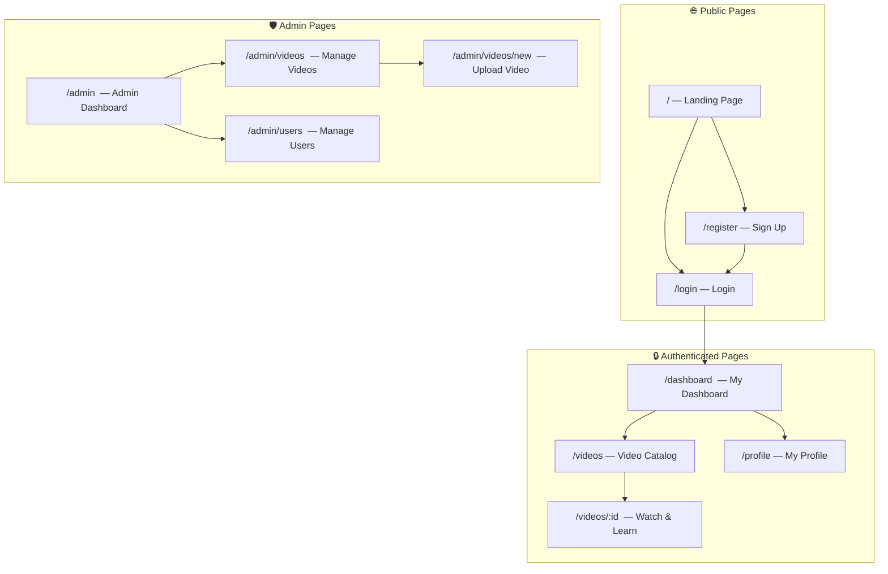
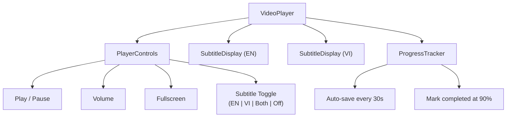
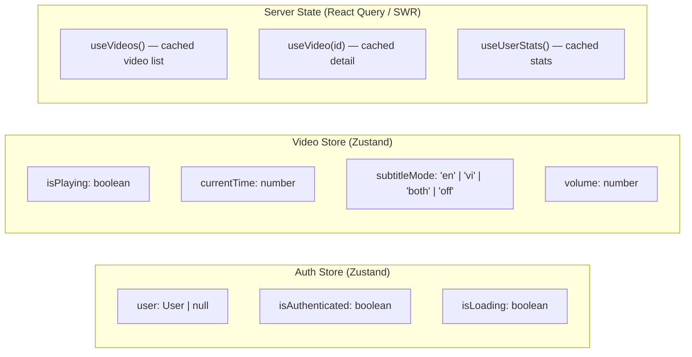

# GLStudy – Frontend Architecture (MVP)

## 1. Page Map & Routes



## 2. Page Descriptions

| Route | Page | Description | Auth |
|---|---|---|---|
| `/` | Landing | Hero section, features, CTA to sign up | No |
| `/login` | Login | Email + password form | No |
| `/register` | Register | Registration form + validation | No |
| `/dashboard` | Dashboard | Stats cards, recent videos, streak info | Yes |
| `/videos` | Video Catalog | Grid of video cards, filters, search, pagination | Yes |
| `/videos/:id` | Video Player | Video player + bilingual subtitles + progress tracking | Yes |
| `/profile` | Profile | Edit display name, avatar, change password | Yes |
| `/admin` | Admin Dashboard | User count, video count, basic analytics | Admin |
| `/admin/videos` | Video Management | CRUD table of all videos | Admin |
| `/admin/videos/new` | Add Video | Form: YouTube URL + subtitle data | Admin |
| `/admin/users` | User Management | List users, view details | Admin |

## 3. Component Architecture

```
src/
├── app/                           # Next.js App Router
│   ├── layout.tsx                 # Root layout (fonts, providers)
│   ├── page.tsx                   # Landing page
│   ├── (auth)/                    # Auth group (no sidebar)
│   │   ├── login/page.tsx
│   │   └── register/page.tsx
│   ├── (main)/                    # Main group (with sidebar/nav)
│   │   ├── layout.tsx             # Main layout with navigation
│   │   ├── dashboard/page.tsx
│   │   ├── videos/
│   │   │   ├── page.tsx           # Video catalog
│   │   │   └── [id]/page.tsx      # Video player
│   │   └── profile/page.tsx
│   ├── admin/                     # Admin group
│   │   ├── layout.tsx             # Admin layout with sidebar
│   │   ├── page.tsx               # Admin dashboard
│   │   ├── videos/
│   │   │   ├── page.tsx           # Video CRUD
│   │   │   └── new/page.tsx       # Upload form
│   │   └── users/page.tsx
│   └── api/                       # BFF API routes
│       ├── auth/
│       │   ├── login/route.ts
│       │   ├── register/route.ts
│       │   ├── refresh/route.ts
│       │   └── logout/route.ts
│       ├── users/
│       │   └── me/route.ts
│       └── videos/
│           ├── route.ts
│           └── [id]/
│               ├── route.ts
│               └── progress/route.ts
├── components/
│   ├── ui/                        # Base UI components
│   │   ├── Button.tsx
│   │   ├── Input.tsx
│   │   ├── Card.tsx
│   │   ├── Badge.tsx
│   │   ├── Modal.tsx
│   │   ├── Skeleton.tsx
│   │   ├── Avatar.tsx
│   │   ├── Pagination.tsx
│   │   └── Toast.tsx
│   ├── layout/                    # Layout components
│   │   ├── Navbar.tsx
│   │   ├── Sidebar.tsx
│   │   ├── Footer.tsx
│   │   └── MobileNav.tsx
│   ├── auth/                      # Auth-specific components
│   │   ├── LoginForm.tsx
│   │   ├── RegisterForm.tsx
│   │   └── AuthGuard.tsx
│   ├── video/                     # Video-specific components
│   │   ├── VideoPlayer.tsx        # Main player with controls
│   │   ├── SubtitleDisplay.tsx    # Bilingual subtitle overlay
│   │   ├── VideoCard.tsx          # Card for catalog grid
│   │   ├── VideoGrid.tsx          # Grid layout for cards
│   │   ├── VideoFilters.tsx       # Difficulty/category filters
│   │   └── ProgressBar.tsx        # Watch progress indicator
│   ├── dashboard/                 # Dashboard components
│   │   ├── StatsCard.tsx
│   │   ├── StreakDisplay.tsx
│   │   ├── RecentVideos.tsx
│   │   └── WelcomeBanner.tsx
│   └── admin/                     # Admin components
│       ├── VideoUploadForm.tsx
│       ├── VideoTable.tsx
│       ├── UserTable.tsx
│       └── AdminStatsCards.tsx
├── hooks/                         # Custom hooks
│   ├── useAuth.ts                 # Auth state & actions
│   ├── useVideos.ts               # Video list fetching
│   ├── useVideoPlayer.ts          # Player state management
│   ├── useSubtitles.ts            # Subtitle sync logic
│   ├── useWatchProgress.ts        # Auto-save progress
│   └── useDebounce.ts             # Utility hook
├── lib/                           # Utilities
│   ├── api-client.ts              # Axios/fetch wrapper
│   ├── auth.ts                    # Token helpers
│   ├── constants.ts               # App constants
│   ├── formatters.ts              # Date, time, number formatters
│   └── validators.ts              # Form validation schemas (Zod)
├── stores/                        # State management
│   ├── auth-store.ts              # Auth state (Zustand)
│   └── video-store.ts             # Video player state (Zustand)
└── styles/
    └── globals.css                # Tailwind + custom styles
```

## 4. Key Component Details

### 4.1 VideoPlayer Component



**Key behaviors:**
- Subtitles synced to current playback time (using `onStateChange` from YouTube IFrame API)
- Toggle between English-only, Vietnamese-only, both, or no subtitles
- Auto-saves watch position every 30 seconds via API
- Marks video as "completed" when user reaches ≥ 90% of duration

### 4.2 SubtitleDisplay Component

```
┌─────────────────────────────────────────┐
│                                         │
│              Video Player               │
│                                         │
│                                         │
│  ┌───────────────────────────────────┐  │
│  │  Hi, can I get a coffee?          │  │  ← English (top)
│  │  Xin chào, cho tôi một ly cà phê │  │  ← Vietnamese (bottom)
│  └───────────────────────────────────┘  │
└─────────────────────────────────────────┘
```

- Subtitle lines highlight as they play
- Click on a subtitle line to seek to that timestamp
- Font size adjustable for accessibility

## 5. Responsive Breakpoints

| Breakpoint | Width | Layout |
|---|---|---|
| Mobile | < 640px | Single column, bottom nav |
| Tablet | 640–1024px | Two columns, collapsible sidebar |
| Desktop | > 1024px | Three columns, persistent sidebar |

## 6. State Management



- **Auth state**: Zustand (persisted in memory, rehydrated from cookie on SSR)
- **Video player state**: Zustand (local to player, no persistence)
- **Server data**: React Query or SWR for caching, deduplication, and background refresh

---

*Next: [06-implementation-roadmap.md](./06-implementation-roadmap.md)*
