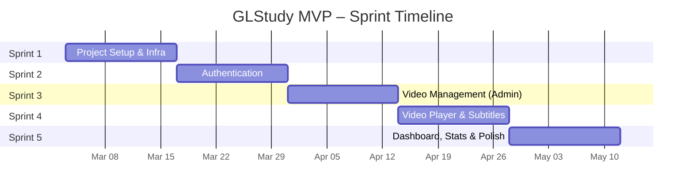

# GLStudy – Implementation Roadmap (MVP)

> Mark: `[ ]` todo · `[/]` in progress · `[x]` done · `[-]` blocked

## 1. Sprint Plan Overview

The MVP is broken into **5 sprints** (2 weeks each = ~10 weeks total).

---

## 2. Sprint Details

### Sprint 1: Project Setup & Infrastructure (Week 1–2)

**Goal**: Get the full dev environment running with all foundational tooling.

| # | Task | Effort | Details |
|---|---|---|---|
| 1.1 | Initialize Spring Boot project | 2h | Java 17, Spring Boot 3, Maven/Gradle |
| 1.2 | Initialize Next.js project | 2h | Next.js 14, TypeScript, Tailwind CSS |
| 1.3 | Docker Compose setup | 2h | PostgreSQL, Redis containers (no MinIO needed) |
| 1.4 | Flyway migration framework | 2h | Configure Flyway, create initial migration |
| 1.5 | Base entity classes & repository setup | 3h | BaseEntity with audit fields |
| 1.6 | Global exception handler | 2h | Standard error response format |
| 1.7 | API response wrapper | 1h | `ApiResponse<T>` envelope |
| 1.8 | Swagger/OpenAPI setup | 1h | Auto-generated API docs |
| 1.9 | Frontend design system | 4h | Tailwind config, tokens, base components |
| 1.10 | Frontend API client | 2h | Axios/fetch wrapper with interceptors |
| 1.11 | ESLint + Prettier + Husky | 1h | Code quality tooling |
| 1.12 | Landing page | 4h | Hero, features, CTA |

**Deliverables:**
- [ ] Both apps run locally via `docker-compose up`
- [ ] Landing page visible at `localhost:3000`
- [ ] Swagger UI at `localhost:8080/swagger-ui.html`
- [ ] Database with schema ready

**Tests:**
- Backend: Application context loads successfully
- Frontend: Landing page renders without errors (Jest + RTL)

---

### Sprint 2: Authentication System (Week 3–4)

**Goal**: Complete auth flow – register, login, logout, session management.

| # | Task | Effort | Details |
|---|---|---|---|
| 2.1 | Users table migration | 1h | Flyway V1 |
| 2.2 | Refresh tokens table migration | 1h | Flyway V2 |
| 2.3 | User entity + repository | 2h | JPA entity with validation |
| 2.4 | Password service | 1h | Bcrypt hashing |
| 2.5 | JWT service | 3h | Generate/validate access + refresh tokens |
| 2.6 | Auth controller | 3h | Register, login, refresh, logout endpoints |
| 2.7 | Spring Security config | 4h | JWT filter, route protection |
| 2.8 | Redis token store | 2h | Refresh token storage + blacklisting |
| 2.9 | User controller | 2h | Profile endpoints (get, update, change password) |
| 2.10 | Frontend: Login page | 3h | Form with validation, error handling |
| 2.11 | Frontend: Register page | 3h | Form with validation |
| 2.12 | Frontend: Auth store (Zustand) | 2h | State + hooks |
| 2.13 | Frontend: AuthGuard component | 2h | Route protection |
| 2.14 | Frontend: Navbar with auth state | 2h | User menu, login/logout |
| 2.15 | Frontend: Profile page | 3h | Edit profile, change password |

**Deliverables:**
- [ ] Users can register, login, and logout
- [ ] JWT tokens issued and refreshed automatically
- [ ] Protected routes redirect unauthenticated users
- [ ] Profile page shows and edits user info

**Tests:**
- Backend: Auth controller unit tests (register, login, invalid credentials)
- Backend: JWT service unit tests
- Backend: Integration tests for auth flow
- Frontend: Login form validation tests
- Frontend: AuthGuard redirect test

---

### Sprint 3: Video Management – Admin (Week 5–6)

**Goal**: Admin can add YouTube-embedded videos, manage metadata, and input bilingual subtitles.

| # | Task | Effort | Details |
|---|---|---|---|
| 3.1 | Videos table migration | 1h | Flyway V3 (with `embed_url`, `youtube_video_id`, `embed_source`) |
| 3.2 | Subtitles table migration | 1h | Flyway V4 |
| 3.3 | Video entity + repository | 2h | JPA entity with embed fields |
| 3.4 | Subtitle entity + repository | 2h | JPA entity |
| 3.5 | YouTube URL parser service | 2h | Extract video ID from YouTube URL, auto-populate thumbnail |
| 3.6 | Admin video controller | 3h | CRUD endpoints (JSON, no file upload) |
| 3.7 | Video list API (public) | 2h | Paginated, filtered, Redis-cached |
| 3.8 | Video detail API | 2h | Include subtitles grouped by language |
| 3.9 | Frontend: Admin layout + sidebar | 3h | Admin navigation |
| 3.10 | Frontend: Video create form | 3h | YouTube URL input + subtitle editor |
| 3.11 | Frontend: Video management table | 4h | CRUD table with status badges |
| 3.12 | Frontend: Video catalog page | 4h | Grid, filters, search, pagination |
| 3.13 | Seed sample data | 2h | 5–10 sample YouTube videos with bilingual subtitles |

**Deliverables:**
- [ ] Admin can add videos by YouTube URL
- [ ] YouTube video ID extracted and thumbnail auto-populated
- [ ] Video metadata + subtitles stored in PostgreSQL
- [ ] Public video catalog with filtering

**Tests:**
- Backend: YouTube URL parser unit tests (various URL formats, invalid URLs)
- Backend: Video CRUD integration tests
- Frontend: Video create form validation tests
- Frontend: Video grid render test

---

### Sprint 4: Video Player & Bilingual Subtitles (Week 7–8)

**Goal**: Interactive video player with synced bilingual subtitles.

| # | Task | Effort | Details |
|---|---|---|---|
| 4.1 | Watch history table migration | 1h | Flyway V5 |
| 4.2 | Watch history entity + repository | 2h | Upsert logic |
| 4.3 | Watch progress API | 3h | Save/load progress, auto-complete |
| 4.4 | Frontend: Video player component | 5h | YouTube IFrame API integration, custom overlay controls |
| 4.5 | Frontend: Subtitle display | 4h | Synced bilingual overlay |
| 4.6 | Frontend: Subtitle toggle | 2h | EN / VI / Both / Off modes |
| 4.7 | Frontend: Auto-save progress | 3h | useWatchProgress hook (30s interval) |
| 4.8 | Frontend: Video detail page | 4h | Player + info + related videos |
| 4.9 | Frontend: Click-to-seek subtitles | 2h | Click subtitle → seek to timestamp |
| 4.10 | Redis caching for video detail | 2h | Cache video + subtitle data |

**Deliverables:**
- [ ] Videos play with synced bilingual subtitles
- [ ] Users can toggle subtitle languages
- [ ] Watch position auto-saved every 30 seconds
- [ ] Videos marked completed at 90% progress
- [ ] Resume from last position

**Tests:**
- Backend: Watch progress API tests (create, update, complete)
- Frontend: Subtitle sync accuracy test
- Frontend: Progress auto-save test (mock timer)
- Integration: Full watch flow (play → progress → complete)

---

### Sprint 5: Dashboard, Statistics & Polish (Week 9–10)

**Goal**: User dashboard, stats, polish, and production readiness.

| # | Task | Effort | Details |
|---|---|---|---|
| 5.1 | User stats table migration | 1h | Flyway V6 |
| 5.2 | User stats service | 3h | Update on video completion, streak logic |
| 5.3 | Stats API endpoint | 2h | `/users/me` includes stats |
| 5.4 | Frontend: Dashboard page | 6h | Stats cards, streak, recent + continue watching |
| 5.5 | Frontend: Stats cards component | 2h | Animated counters |
| 5.6 | Frontend: Streak display | 2h | Fire emoji streak visualization |
| 5.7 | Frontend: Continue watching section | 3h | Resume cards with progress bars |
| 5.8 | Frontend: Dark mode toggle | 3h | System preference + override |
| 5.9 | Frontend: Loading skeletons | 2h | Skeleton screens for all pages |
| 5.10 | Frontend: Error boundaries | 2h | Graceful error handling |
| 5.11 | Frontend: Toast notifications | 1h | Success/error feedback |
| 5.12 | Admin: Basic dashboard | 3h | Total users, videos, recent activity |
| 5.13 | SEO: Meta tags & OG tags | 2h | SSR-friendly meta tags |
| 5.14 | Performance: Lighthouse audit | 2h | Fix performance issues |
| 5.15 | Seed admin user | 1h | Flyway V7 |
| 5.16 | README & developer docs | 2h | Setup guide, architecture overview |

**Deliverables:**
- [ ] User dashboard with stats and streak tracking
- [ ] Dark mode support
- [ ] Loading states and error handling
- [ ] SEO-optimized pages
- [ ] Production-ready MVP

**Tests:**
- Backend: Streak calculation unit tests (edge cases: midnight, timezone)
- Backend: Stats update integration tests
- Frontend: Dashboard render tests
- E2E: Complete user journey (register → browse → watch → dashboard)

---

## 3. Definition of Done (per Sprint)

- [ ] All tasks completed and code reviewed
- [ ] Unit test coverage ≥ 70% for new code
- [ ] No critical or high-severity bugs
- [ ] API documentation up-to-date in Swagger
- [ ] Responsive on mobile, tablet, and desktop
- [ ] Performance: page load < 2.5s, API response < 300ms

## 4. Risk Register

| Risk | Impact | Probability | Mitigation |
|---|---|---|---|
| YouTube API unavailability | Medium | Low | Graceful fallback message; plan self-hosted video for Phase 2 |
| Subtitle sync accuracy | Medium | Medium | Use precise timestamps (ms), manual QA |
| JWT token security | High | Low | httpOnly cookies, short expiry, Redis blacklist |
| Scope creep | High | High | Strict MVP feature gate, defer Phase 2 items |
| Solo developer bottleneck | Medium | High | Detailed docs, modular code for easy resumption |

## 5. Post-MVP Priorities (Phase 2)

Priority order for features after MVP launch:

1. **Video loop & speed controls** – high impact, low effort
2. **Bookmark / favorite videos** – high impact, low effort
3. **Grammar lessons module** – new content type, medium effort
4. **Role-based access (RBAC)** – needed before multi-admin
5. **CI/CD pipeline (GitHub Actions)** – reliability
6. **Push notifications** – engagement booster
7. **AI transcript generation** – high value, needs AI integration
8. **Online exam room** – complex, needs careful design
9. **AI conversation assistant** – highest complexity

---

*Back to [01-project-overview.md](./01-project-overview.md)*
