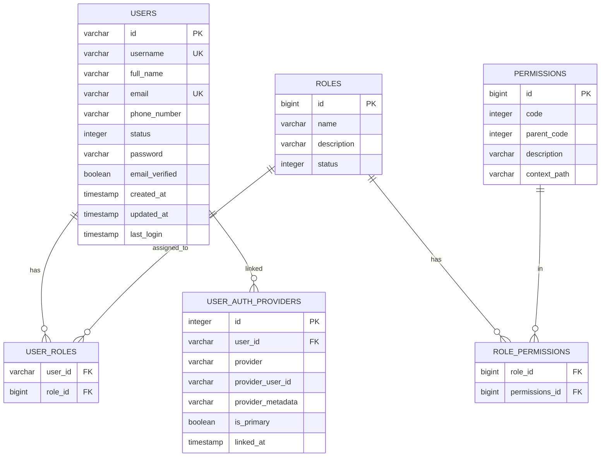

# gl-auth-api – Database Schema

PostgreSQL schema name: **`glauth`**

## Entity Relationship Diagram

## Table Definitions

### `users`

| Column | Type | Constraints | Description |
|---|---|---|---|
| `id` | `VARCHAR` | PK | Nanoid-generated string (via `com.aventrix.jnanoid`) |
| `username` | `VARCHAR` | UNIQUE, NOT NULL | Login username |
| `full_name` | `VARCHAR` | NULLABLE | Display name |
| `email` | `VARCHAR(255)` | UNIQUE, NOT NULL | Login email |
| `phone_number` | `VARCHAR` | NULLABLE | Phone number |
| `status` | `INTEGER` | NULLABLE | `0` = inactive, `1` = active |
| `password` | `VARCHAR` | NULLABLE | bcrypt-hashed; null for SSO-only users |
| `email_verified` | `BOOLEAN` | NULLABLE | Email verification flag |
| `created_at` | `TIMESTAMP` | NOT NULL | Registration timestamp |
| `updated_at` | `TIMESTAMP` | NOT NULL | Last update timestamp |
| `last_login` | `TIMESTAMP` | NULLABLE | Most recent login timestamp |

> Users who registered via SSO have `password = null`. `POST /v1/users/set-password` allows them to add a local password later.

---

### `roles`

| Column | Type | Constraints | Description |
|---|---|---|---|
| `id` | `BIGINT` | PK, sequence | Auto-generated |
| `name` | `VARCHAR` | NULLABLE | e.g. `ROLE_LEARNER`, `ROLE_ADMIN` |
| `description` | `VARCHAR` | NULLABLE | Human-readable description |
| `status` | `INTEGER` | NULLABLE | Active/inactive flag |

---

### `permissions`

| Column | Type | Constraints | Description |
|---|---|---|---|
| `id` | `BIGINT` | PK, sequence | Auto-generated |
| `code` | `INTEGER` | NULLABLE | Permission code |
| `parent_code` | `INTEGER` | NULLABLE | Parent permission code (hierarchical) |
| `description` | `VARCHAR` | NULLABLE | Description |
| `context_path` | `VARCHAR` | NULLABLE | API path this permission covers |

---

### `user_roles` (junction)

| Column | Type | Constraints |
|---|---|---|
| `user_id` | `VARCHAR` | FK → `users.id` |
| `role_id` | `BIGINT` | FK → `roles.id` |

---

### `role_permissions` (junction)

| Column | Type | Constraints |
|---|---|---|
| `role_id` | `BIGINT` | FK → `roles.id` |
| `permissions_id` | `BIGINT` | FK → `permissions.id` |

---

### `user_auth_providers`

| Column | Type | Constraints | Description |
|---|---|---|---|
| `id` | `INTEGER` | PK, sequence | Auto-generated |
| `user_id` | `VARCHAR` | FK → `users.id`, NOT NULL | Owning user |
| `provider` | `VARCHAR` | NULLABLE | `local`, `google`, `github` |
| `provider_user_id` | `VARCHAR` | NULLABLE | Provider's user identifier (sub / id) |
| `provider_metadata` | `VARCHAR` | NULLABLE | JSON blob of raw provider profile data |
| `is_primary` | `BOOLEAN` | NULLABLE | Whether this is the primary login method |
| `linked_at` | `TIMESTAMP` | NOT NULL | When the provider was linked |

**Indexes:**
- `idx_user_auth_providers_user_id` on `user_id`

**Constraints:**
- `UNIQUE (user_id, provider)` — one record per user per provider
